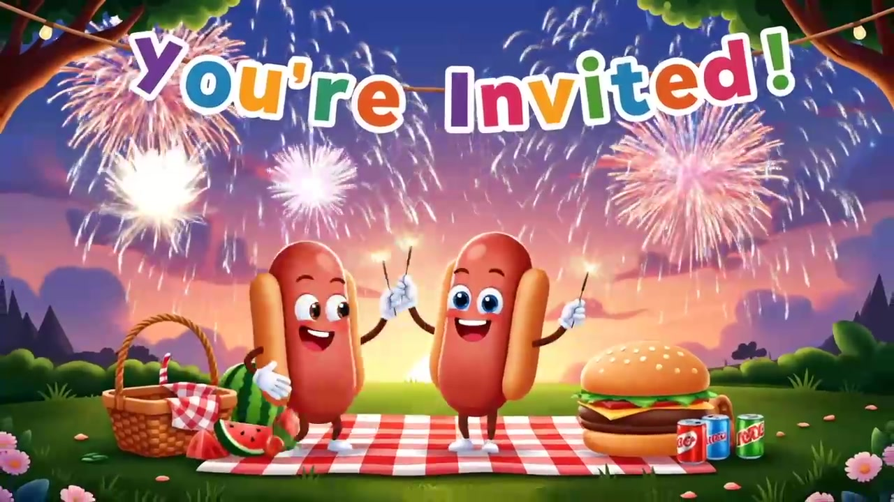
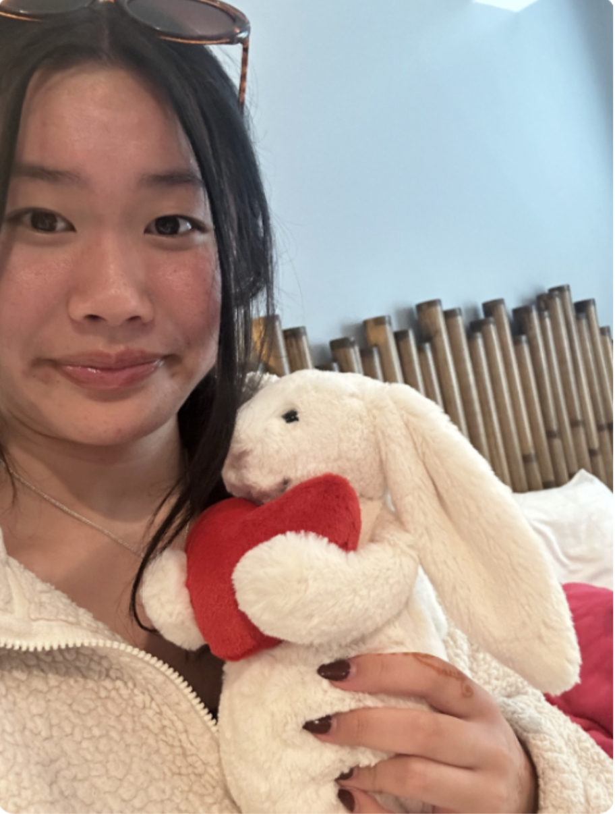
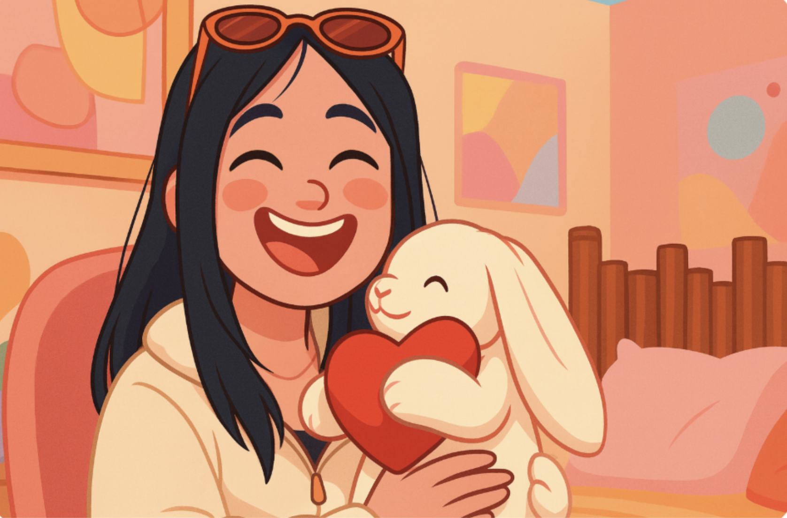
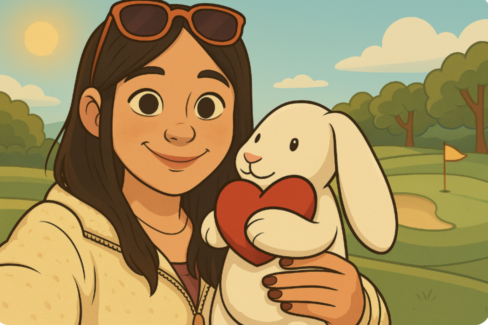

 

I created this invite video for a 4th of July party. 

<video width="700" controls poster="4th-invite-thumb.jpg">
  <source src="4th-invite.MOV" type="video/mp4">
  Your browser does not support the video tag.
</video>

## Veo 3 with ChatGPT help
I used Veo 3 for the first time to create the intro. A big difference I noticed between Veo 2 and Veo 3, is that Veo 3 has audio. 

I first used ChatGPT to generate a prompt:

> A colorful cartoon-style 4th of July party invitation with fireworks bursting in the
sky, smiling anthropomorphic hot dogs and hamburgers dancing with sparklers, children
waving American flags, red-white-and-blue balloons floating around, and a big banner
that says "You're Invited!" in playful letters. The scene is festive and family-
friendly, with a picnic setup and a summer sunset in the background.

I fed the prompt to Veo 3 and got this result.  It turned out really well.

<video width="700" controls poster="invited-placeholder.png">
  <source src="invited-placeholder.mp4" type="video/mp4">
  Your browser does not support the video tag.
</video>

## Photo ➡️ ChatGPT ➡️ Keyfame images
For the rest of the video, I wanted to have cartoon versions of my family doing summer activities, like golfing or canoeing. To start, I first gave ChatGPT a photo of a family member by themselves. 

For instance, this is the photo I used for my sister.

 

My prompt was:

> Show her and the bunny in a cartoonish animation way. 

The result was the image to the right. 

Although the image turned out well, I wanted a different background. ChatGPT allows me to recompose the photo with a prompt, so when I wanted the character in a golfcourse, the result was pretty good.

The reason why I didn’t use Veo 2 for animating, was because even simple tasks like walking into a garden could be hard for it to create.  To make sure there was less variation and more accuracy, I "keyframed" an initial scene with ChatGPT assistance, so I could more quickly get the character and background I wanted. 

## Image ➡️ Veo 2
Once I finished animating all my family members, I inserted the image into Veo 2 (because Veo 3 doesn’t allow frames to video when creating), and created a prompt for different activities. The rest was pretty straightforward, and I only needed to edit the prompts of a few videos, to make the instructions more clear for Veo 2 to understand. 

Throughout this process, I also tried using Veo 2 Quality instead of Veo 2 Fast, and although the quality version takes a little longer to load, the scenes make more sense. For instance, when I wanted to create a clip where my sister roasted a marshmallow, the Fast version couldn’t create that. But, when I used Quality, it created a video in one go.

Fast
<video controls poster="marshmallow-fast.png" style="width:500px; max-width:100%; display:block;">
  <source src="marshmallow-fast.mp4" type="video/mp4">
  Your browser does not support the video tag.
</video> 

Quality
<video controls poster="marshmallow-quality.png" style="width:500px; max-width:100%; display:block;">
  <source src="marshmallow-quality.mp4" type="video/mp4">
  Your browser does not support the video tag.
</video>

Overall when creating this video, I experimented with ChatGPT, Veo 2 and Veo 3.
