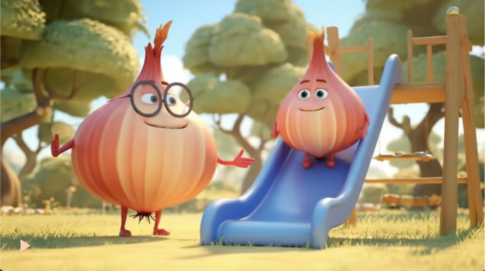
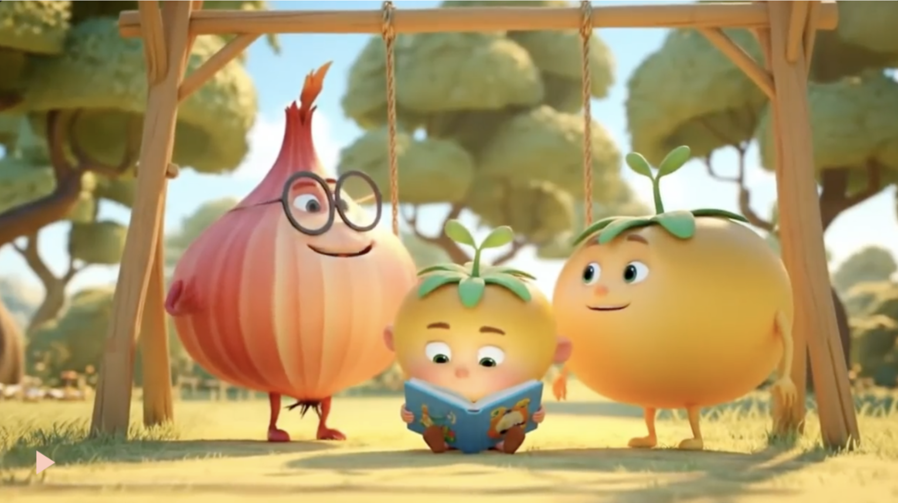
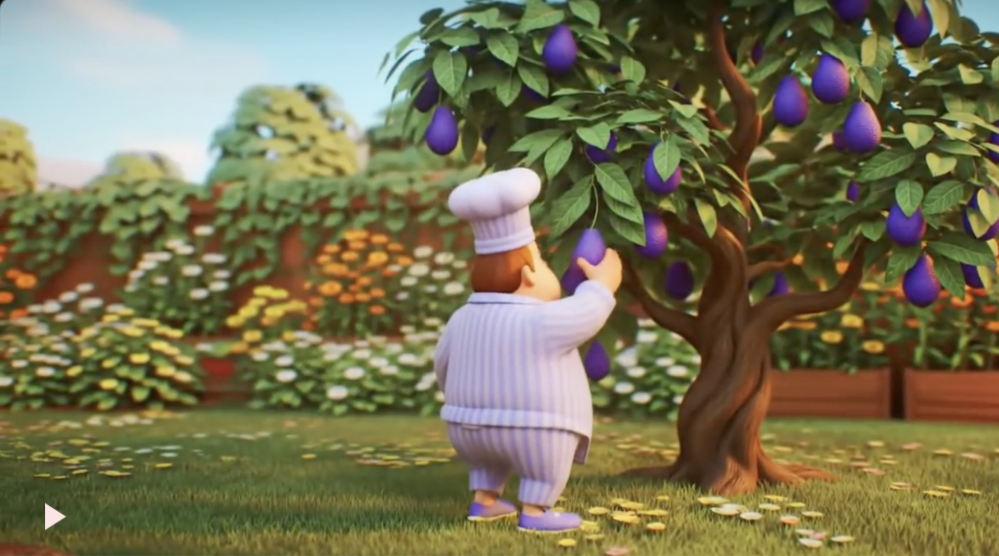
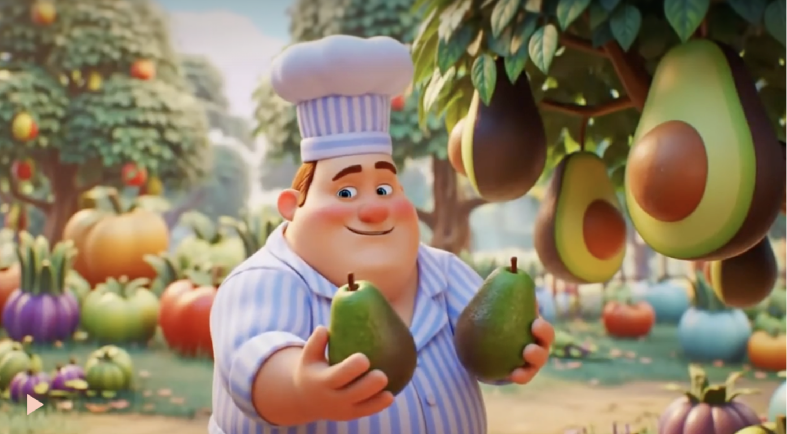

This video is about a chef who makes guacamole. It starts off with the chef’s dream, where families of avocado, red onion, and yellow tomato families do normal things in a park like walk, play on the swings, or read a book. The chef wakes up, and feeling hungry, he goes into his backyard garden to gather the ingredients. He then blends the ingredients into guacamole, and enjoys it with tortilla chips.

### Steps
To make this video, I used [Veo 2](https://deepmind.google/models/veo/) to generate images of the vegetables doing things. At first, It was difficult, because I couldn't get the vegetables to do the things that I wanted. 

For example, when I wanted a family of tomatoes to play on the slides at the park, my prompt was:
 
> The camera shifts to the left, and reveals a toddler red tomato sliding down a blue slide on the park's playground. The adult red tomato is standing and watching the toddler tomato.
ß

This was the result I got. Although Veo 2 included elements that I wanted, the vegetables were onions, not tomatoes. After two tries of similar things like this happening, I decided to have the tomatoes do a different motion. My prompt was:

> The scene cuts to a yellow tomato toddler sitting in a field of grass, reading a book. His parents, one orange tomato, and one yellow tomato, watch him. 

The product was this, and although the scene didn’t include a picnic, it worked, so I used it.  For the next scenes I made, I tried two times, just to try and get the best result. For example, when I wanted a scene where a chef picked avocados from a tree, my prompt was:

>He walks up to an avacado tree, and picks a ripe avacado.

 However, I got this result, where an avocado tree grows out of nowhere.

I realized that even a simple prompt could be harder when building off of another scene, so instead of expanding a current scene that I already had of a chef walking into the garden, I used the image of the chef to keep the same person, but change the background. My prompt was:

> The chef walks in his own small personal garden. He stops in front of an avocado tree, and picks two ripe avocados.

 The product was this.

The result was much better. For the last scenes, it was pretty straightforward, and Veo 2 did a good job of doing what I told it to do. 

### Lessons
In this project, I learned that although Veo 2 is good at creating footage from scratch, expanding the video clip doesn’t always work the best because the scene might not make sense, like how an avocado tree spawned out of nowhere. 

It's good to include as much detail as possible in the prompts by either giving Veo 2 an image to work with, or using descriptive language to describe the scene, so it doesn’t have to guess. 

Additionally, a lot of the time, the video didn’t turn out exactly as I wanted, and I had to work with it. I changed my plot multiple times because I didn't like how things looked, but now I realize that I should just work with what I get, and not try to make everything my way.
